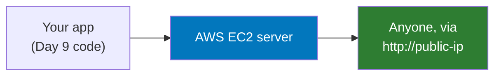

# Docker - Day 10: Capstone Projects

> **Goal of today:** stop practising and build something real. You will take the Day 9 application and deploy it to a live AWS EC2 server that anyone can open in a browser - first as a working deployment, then hardened to production standard.

This is where everything from Days 1-9 comes together: images, Dockerfiles, volumes, networking, multi-stage builds, and Compose. There are two projects. Do them in order - the second is the first, leveled up.

---

## Why a real deployment (not just localhost)

Up to now your containers ran on your own laptop. Real engineers deploy to servers other people can reach. That is the whole point of these capstones: the deliverable is a **live public IP** where your app actually works. "It runs on my machine" is not a deployment - a working URL is.

---

## The two projects

| | Project 1 - Deploy to the Cloud | Project 2 - Make It Production-Grade |
|---|---|---|
| Mindset | "Make it run in the cloud" | "Make it production-ready" |
| EC2 | One instance, app ports open | Dedicated instance, only 80/443 open |
| Entry point | Direct to the app | Single reverse proxy (/ -> frontend, /api -> backend) |
| Networks | One shared network | Tiered - frontend cannot reach the database |
| Images | Working, non-root frontend | Multi-stage, hardened, sizes reported |
| Extras | - | Resource limits, healthchecks everywhere, secrets, README + architecture diagram |
| Proof | Live IP works | Live IP works, secured, and documented |

- **[Project 1 - Deploy the App to the Cloud](Project-1-Deploy-to-Cloud.txt)** - the foundational capstone. Get the Day 9 app running on a single EC2 instance and share the live public IP.
- **[Project 2 - Make It Production-Grade](Project-2-Production-Grade.txt)** - the advanced capstone. Re-deploy the same app the way a company would: reverse proxy, isolated networks, resource limits, hardened images, proper secrets, and full documentation, on its own dedicated EC2 instance.

> Start with Project 1. Once it works end to end, Project 2 builds directly on top of it - you harden a thing that already runs, exactly like real work.

---

## The app you deploy

Both projects use the **Day 9 project** (React frontend served by nginx + FastAPI backend + PostgreSQL). You do not write application code - you focus entirely on containerizing and deploying it well. The source is in [`../day9-docker-compose/project`](../day9-docker-compose/project).

---

## What you will prove you can do

By finishing these capstones you can:
- Launch and configure an EC2 instance and its security group.
- Install Docker and Docker Compose on a real Linux server.
- Deploy a multi-container app that persists data across restarts.
- Put an app behind a reverse proxy with isolated, tiered networks.
- Build small, hardened, non-root, multi-stage images and report their sizes.
- Handle secrets correctly and document an architecture - a portfolio-ready result.

---

## Ground rules (read before you start)

- Use only **free-tier** resources (t2.micro), and **stop or terminate** your EC2 instance once it has been checked - a running instance can cost money.
- Never commit AWS keys, passwords, or `.env` files to GitHub.
- The full requirements, checklists, and submission details are in the two project files linked above.

---

## Submit

For each project: the **live public IP**, a link to your **GitHub repo**, and a **screenshot** of the app working in a browser with the EC2 IP in the address bar. Project 2 also needs a README with an architecture diagram and your reported image sizes.

**Previous:** [Day 9 - Docker Compose](../day9-docker-compose/notes.md)
Next module -> [learn-k8s](../../learn-k8s) - run these containers at scale.
